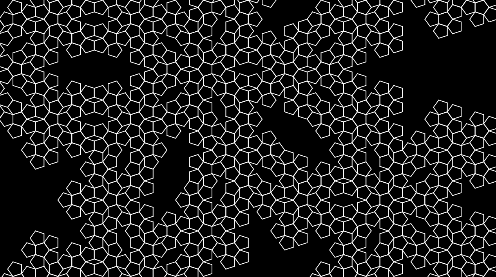
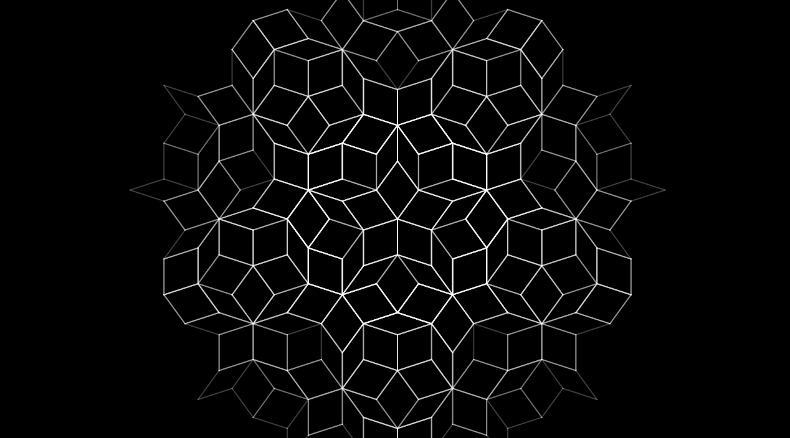

# Mjay-Project-9103

## Imaging Technique Inspiration

### Generative Geometry  
I was inspired by **generative design techniques** that transform **simple mathematical rules** into **complex visual patterns**. This approach often relies on **algorithmic movement** to produce forms that feel both **organic and structured**, much like those found in **contemporary digital art and motion graphics**. I aim to apply this technique to investigate how **minimal inputs such as rotation or repetition** can generate **visually rich and evolving compositions**. It aligns with the assignment’s focus on **visual experimentation** and highlights how **computational design** can balance **precision** with **aesthetic unpredictability**.

The line is moving in simple way.

But create complex pattern.

## Coding Technique Exploration

**Technique:**  
This example below uses a few parameters (seed, angle, iteration count) and mathematics formula to control the movement of the line. I want to learn it because it aligns with my imaging goal of “simple motion → complex beauty.” This example provides me with precise guidance while enabling emergent variation without manual drawing.

**Example link:**  
[Processing – Penrose Snowflake](https://processing.org/examples/penrosetile.html)

